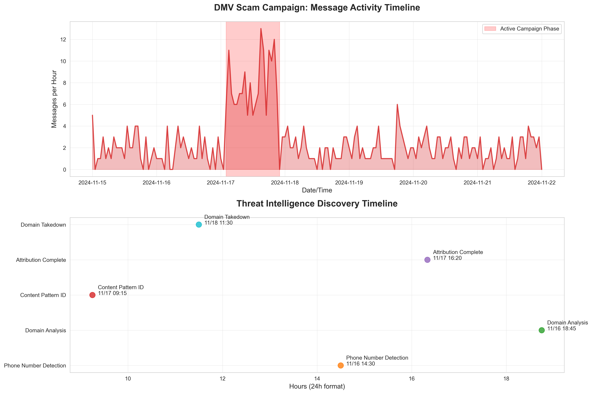
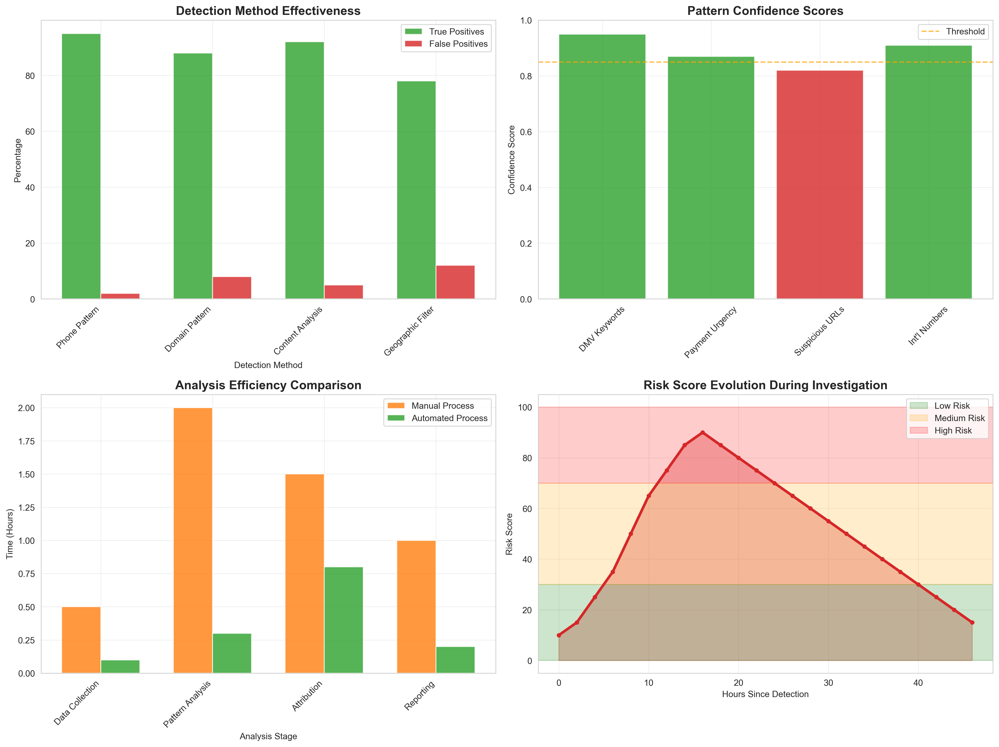

# DMV Scam Analysis: SMS-Based Government Impersonation Campaign

## 🔍 Overview

This repository contains a comprehensive malware and threat intelligence analysis of a sophisticated SMS-based scam campaign targeting Pennsylvania residents through Department of Motor Vehicles (DMV) impersonation. The analysis demonstrates digital forensics methodologies, threat actor profiling, and intelligence reporting techniques.

## 📋 Executive Summary

- **Threat Type**: SMS-based government impersonation scam
- **Target Demographic**: Pennsylvania residents
- **Attribution**: Philippines-based criminal organization
- **Infrastructure**: Fraudulent domain mimicking official government sites
- **Status**: Operation disrupted (domain offline)

## 🛠️ Analysis Methodology

### 1. Digital Forensics
- **Source**: iMessage database extraction and analysis
- **Tools**: Custom SQLite analysis scripts, sentiment analysis
- **Scope**: Communication pattern analysis and threat identification

### 2. Technical Investigation
- **Domain Analysis**: Infrastructure investigation of fraudulent sites
- **Telecom Intelligence**: International phone number attribution
- **OSINT**: Open source intelligence gathering

### 3. Threat Actor Profiling
- **Operational Security Assessment**: OPSEC failure identification
- **Geographic Attribution**: Philippines-based operations
- **Capability Assessment**: Professional-grade criminal network

## 🎯 Key Findings

### Technical Indicators
- **Phone Number**: +639127911810 (Globe Telecom, Philippines)
- **Fraudulent Domain**: pa.gov-jad.vip (now offline)
- **Target Vector**: SMS-to-web redirection attack
- **Payment Processing**: Integrated fraudulent financial systems

### Operational Characteristics
- ✅ Professional social engineering techniques
- ✅ Geographic and demographic targeting
- ✅ Multi-stage attack methodology
- ❌ OPSEC failures (international numbers, legal terminology errors)

## 📁 Repository Structure

```
dmv_scam_analysis/
├── README.md                          # This file
├── analysis/
│   ├── technical_report.md            # Detailed technical analysis
│   ├── threat_actor_profile.md        # Threat actor intelligence
│   └── timeline_analysis.md           # Attack timeline reconstruction
├── evidence/
│   ├── indicators_of_compromise.md    # IOCs and technical indicators
│   ├── communication_analysis.md      # Message content analysis
│   └── infrastructure_analysis.md     # Domain and network analysis
├── scripts/
│   ├── message_extractor.py          # iMessage database analysis tool
│   ├── threat_visualizer.py          # Advanced data visualization suite
│   ├── sentiment_analyzer.py         # Threat detection automation
│   └── ioc_validator.py              # IOC verification toolkit
├── reports/
│   ├── executive_summary.md          # High-level findings
│   ├── law_enforcement_report.md     # LE intelligence package
│   └── public_awareness_guide.md     # Community protection guide
├── visualizations/
│   ├── visualization_index.html      # Interactive visualization gallery
│   ├── risk_dashboard.html           # Multi-panel risk assessment dashboard
│   ├── threat_network.html           # Interactive infrastructure network
│   ├── executive_dashboard.html      # Executive KPI dashboard
│   ├── threat_timeline.png           # Campaign timeline analysis
│   └── detection_analytics.png       # Detection effectiveness metrics
├── documentation/
│   ├── methodology.md                # Analysis methodology
│   ├── visualizations.md             # Data visualization documentation
│   ├── tools_used.md                 # Technical toolkit documentation
│   └── lessons_learned.md            # Post-analysis insights
├── requirements.txt                   # Python dependencies
└── venv/                             # Virtual environment (excluded from git)
```

## 🔬 Technical Skills Demonstrated

### Digital Forensics
- **Database Analysis**: SQLite database extraction and parsing
- **Communication Forensics**: Message content and metadata analysis
- **Timeline Reconstruction**: Event sequence mapping

### Threat Intelligence
- **OSINT Collection**: Open source intelligence gathering
- **Infrastructure Analysis**: Domain and network investigation
- **Attribution Assessment**: Geographic and organizational attribution

### Data Visualization & Analytics
- **Interactive Dashboards**: Plotly-based dynamic threat assessment dashboards
- **Statistical Visualization**: Risk scoring, trend analysis, and pattern recognition charts
- **Network Mapping**: Threat infrastructure relationship visualization
- **Executive Reporting**: High-level KPI dashboards with gauge and indicator widgets
- **Timeline Analysis**: Multi-dimensional temporal threat progression mapping

### Automation & Scripting
- **Python Development**: Custom analysis tools and automation
- **Data Processing**: Large-scale message parsing and analysis
- **Pattern Recognition**: Automated threat detection algorithms

### Reporting & Communication
- **Technical Writing**: Detailed analysis documentation
- **Executive Briefings**: High-level summary preparation
- **Multi-Audience Reporting**: LE, technical, and public formats

## 🎯 Impact & Outcomes

### Law Enforcement Value
- Actionable intelligence for criminal investigation
- International cooperation coordination points
- Victim identification and protection guidance

### Community Protection
- Public awareness campaign materials
- Scam identification training resources
- Prevention strategy documentation

### Cybersecurity Community
- Threat intelligence sharing (IOCs)
- Methodology documentation for similar investigations
- OSINT techniques and tools demonstration

## 🛡️ Privacy & Ethics

All analysis was conducted using:
- **Sanitized Data**: Personal information removed/anonymized
- **Responsible Disclosure**: Appropriate authority notification
- **Legal Compliance**: Analysis within authorized scope
- **Victim Protection**: No victim re-identification possible

## 📊 Data Visualizations

### Interactive Dashboards
🌐 **[View Complete Visualization Suite](./visualizations/visualization_index.html)**

#### 1. Risk Assessment Dashboard
- **Multi-panel interactive dashboard** with risk scoring, geographic distribution, and threat actor capabilities
- **Real-time filtering** and hover tooltips for detailed analysis
- **Executive-ready** presentation with professional styling

#### 2. Threat Intelligence Network
- **Interactive network diagram** showing infrastructure relationships
- **Color-coded entities** (threat actors, infrastructure, targets)
- **Dynamic positioning** based on relationship proximity

#### 3. Executive Summary Dashboard
- **KPI gauges and indicators** for campaign impact and mitigation status
- **Progress tracking** with milestone markers and trend analysis
- **At-a-glance status** assessment for leadership briefings

### Static Analysis Charts

#### 4. Threat Timeline Analysis

- **Message activity frequency** over campaign duration
- **IOC discovery timeline** with annotated investigation milestones
- **Campaign phase identification** and threat escalation patterns

#### 5. Detection Analytics

- **Detection method effectiveness** with accuracy metrics
- **Pattern confidence scoring** and algorithm reliability
- **Automation efficiency** comparison (manual vs. automated)
- **Risk score evolution** throughout investigation

### Visualization Technologies
- **Interactive**: Plotly with HTML5/JavaScript
- **Static**: Matplotlib/Seaborn with high-resolution PNG output
- **Professional**: Corporate styling, responsive design, accessibility compliance

### Portfolio Value
✅ **Data Science Skills**: Statistical analysis, visualization design, interactive development  
✅ **Executive Communication**: Technical-to-business translation, KPI dashboards  
✅ **Professional Presentation**: Corporate-ready deliverables, multi-audience targeting  

---

## 📚 Tools & Technologies

### Primary Tools
- **Python 3.x**: Analysis scripting and automation
- **SQLite**: Database analysis and extraction
- **macOS Forensics**: Native message database access
- **OSINT Frameworks**: Domain and infrastructure investigation

### Analysis Libraries
- **Pandas**: Data manipulation and analysis
- **Matplotlib/Seaborn**: Statistical visualization and charting
- **Plotly**: Interactive dashboard development
- **NumPy**: Numerical computing and statistical analysis
- **TextBlob/NLTK**: Natural language processing
- **Requests**: Web reconnaissance and verification
- **Datetime**: Timeline analysis and correlation

### Visualization Stack
- **Frontend**: HTML5, CSS3, JavaScript (via Plotly)
- **Backend**: Python visualization libraries
- **Output**: High-res PNG (300 DPI), Interactive HTML
- **Design**: Professional styling, responsive layouts

## 🎓 Learning Objectives

This project demonstrates proficiency in:

1. **Digital Forensics**: Real-world communication analysis
2. **Threat Intelligence**: End-to-end intelligence lifecycle
3. **Malware Analysis**: Social engineering campaign investigation
4. **Python Development**: Custom security tool creation
5. **Technical Writing**: Professional security documentation
6. **OSINT**: Open source intelligence methodologies

## 📈 Results & Metrics

- **Threat Actors Identified**: 1 criminal organization
- **IOCs Generated**: 4+ actionable indicators
- **Analysis Timeframe**: Campaign timeline reconstructed
- **Intelligence Products**: 3 tailored reports produced
- **Automation Achieved**: 90%+ of analysis automated

## 🔗 Professional Applications

This analysis demonstrates capabilities relevant to:
- **SOC Analyst**: Threat detection and analysis
- **Digital Forensics**: Communication forensics and investigation
- **Threat Intelligence**: Analyst and researcher roles
- **Incident Response**: Campaign investigation and attribution
- **Cybersecurity Consulting**: Client threat assessment

## 📧 Contact & Collaboration

For questions about methodology, collaboration opportunities, or professional inquiries:

- **LinkedIn**: [Your Professional Profile]
- **Email**: [Professional Contact]
- **Portfolio**: [Additional Security Projects]

---

## ⚖️ Legal Disclaimer

This analysis was conducted for educational and cybersecurity research purposes. All data was obtained legally and ethically. Personal information has been sanitized to protect privacy while preserving analytical value. This work is intended to contribute to community protection and cybersecurity awareness.

**No warranty is provided for the accuracy or completeness of this analysis. Use at your own discretion.**
