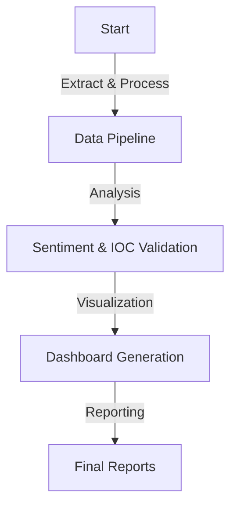
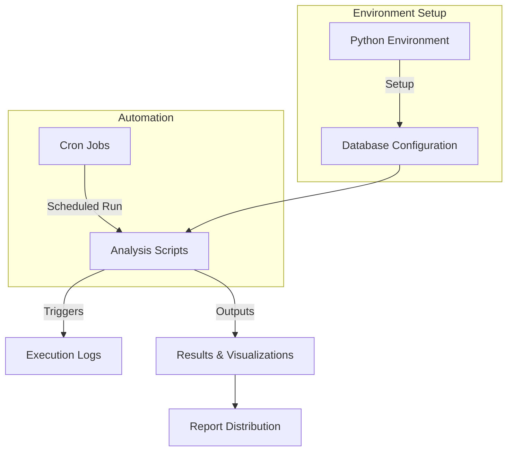
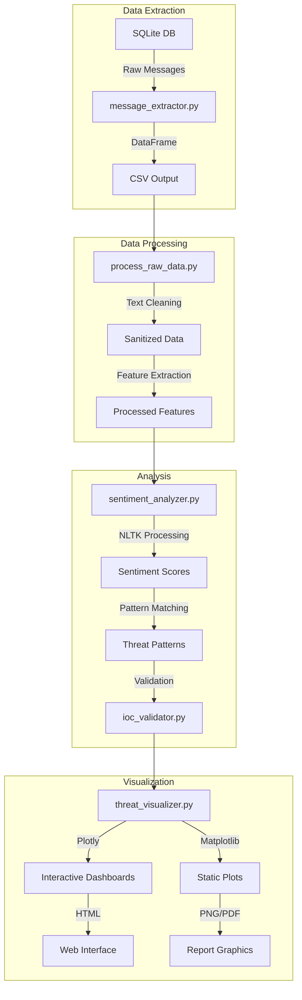
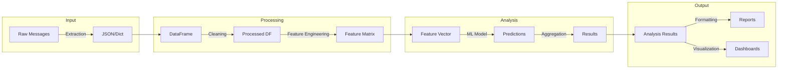

# Data Flow Diagrams
## DMV Scam Analysis Project

### Overview
This document provides data flow diagrams illustrating the interaction between various analysis tools within the DMV scam analysis project.

## Data Extraction and Processing
```mermaid
graph TD;
    A[Extract Messages (message_extractor.py)] --2 CSV --> B[Process Data (process_raw_data.py)];
    B -- Cleaned Data --> C[Sentiment Analysis (sentiment_analyzer.py)];
    C -- Results --> D[Validate IOCs (ioc_validator.py)];
```

## Analysis and Visualization
```mermaid
graph TD;
    D -- Validated IOCs --> E[Visualize Threats (threat_visualizer.py)];
    E -- Visual Data --> F[Generate Reports (generate_reports.py)];
```

## End-to-End Workflow


## Integration and Execution


## Detailed Technical Flow


## Data Transformations


### Legend
- **Nodes**: Represent steps or tools in the data flow
- **Edges**: Indicate data or process flow between nodes
- **Subgraphs**: Group related components or functions

---

**Document Version**: 1.0  
**Last Updated**: June 2025  
**Status**: Active  
**Review Date**: December 2025
