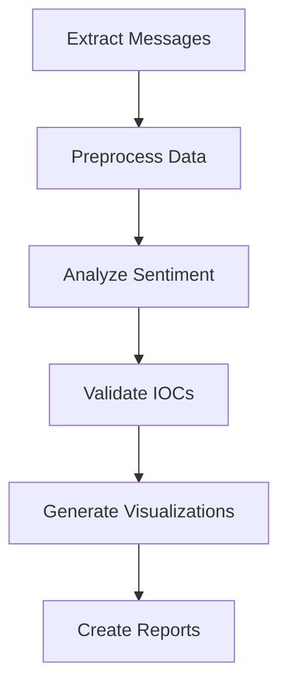

# Tool Integration Documentation

## DMV Scam Analysis Project

### Overview

This document explains how the various Python scripts in the DMV scam analysis project integrate to form a cohesive analysis pipeline. It details the functionality of each script and how they interact to accomplish the goals of the investigation.

## Script Overview

### 1. Data Extraction

- **`message_extractor.py`**
  - Extracts messages from the macOS iMessage database (`chat.db`)
  - Filters messages relevant to the investigation
  - Outputs data to a structured DataFrame for analysis

Usage:

```bash
python scripts/message_extractor.py --input db/chat.db --output data/messages.csv
```

### 2. Data Processing

- **`process_raw_data.py`**
  - Cleans and preprocesses raw message data
  - Applies text sanitization to remove sensitive information
  - Normalizes data fields for consistency

Usage:

```bash
python scripts/process_raw_data.py --input data/messages.csv --output data/processed_messages.csv
```

### 3. Analysis Automation

- **`sentiment_analyzer.py`**
  - Performs sentiment analysis on message content
  - Identifies patterns indicative of threats
  - Produces analytical outputs for further review

Usage:

```bash
python scripts/sentiment_analyzer.py --input data/processed_messages.csv --output data/sentiment_results.csv
```

- **`ioc_validator.py`**
  - Validates indicators of compromise (IOCs)
  - Matches patterns against known threat intelligence
  - Compiles validated IOCs into reports

Usage:

```bash
python scripts/ioc_validator.py --input data/sentiment_results.csv --output data/validated_iocs.csv
```

### 4. Data Visualization

- **`threat_visualizer.py`**
  - Generates visualizations of the analytical results
  - Creates interactive dashboards and static images
  - Visualizes threat patterns, timelines, and network relationships

Usage:

```bash
python scripts/threat_visualizer.py --input data/validated_iocs.csv --output visualizations/
```

- **`risk_dashboard_generator.py`** (hypothetical)
  - Compiles risk assessment data into a dashboard
  - Provides an executive view of threat levels and impacts
  - Enhances decision-making with visual insights

### 5. Reporting

- **`generate_reports.py`**
  - Creates comprehensive reports based on analysis
  - Integrates visualizations and key findings
  - Produces documents for various stakeholders

Usage:

```bash
python scripts/generate_reports.py --input data/validated_iocs.csv --output reports/
```

## Workflow Integration

### Data Flow Diagram



### Process Coordination

1. **Extraction to Processing**:

   - `message_extractor.py` produces raw CSV for `process_raw_data.py`

2. **Processing to Analysis**:

   - `process_raw_data.py` feeds `sentiment_analyzer.py` for further insights

3. **Analysis to Validation**:

   - `sentiment_analyzer.py` output is validated by `ioc_validator.py`

4. **Validation to Visualization**:

   - `ioc_validator.py` results drive `threat_visualizer.py`

5. **Visualization to Reporting**:
   - Visuals from `threat_visualizer.py` included in reports from `generate_reports.py`

### Integration Best Practices

- Maintain consistent data formats across scripts
- Use configuration files to manage shared settings
- Implement logging to track script execution and errors
- Validate data at each stage to ensure integrity
- Modular design for flexibility and scalability

## Implementation Example

### 1. Shared Configuration

```python
# config.py
from pathlib import Path

class Config:
    # Base paths
    BASE_DIR = Path(__file__).parent.parent
    DATA_DIR = BASE_DIR / 'data'
    OUTPUT_DIR = BASE_DIR / 'output'

    # Database settings
    DB_PATH = DATA_DIR / 'chat.db'

    # Analysis parameters
    THREAT_THRESHOLD = 0.8
    CONFIDENCE_THRESHOLD = 0.7

    # Visualization settings
    VIZ_DPI = 300
    VIZ_FIGSIZE = (12, 8)
```

### 2. Data Pipeline Integration

```python
# analysis_pipeline.py
from pathlib import Path
import pandas as pd
from typing import Dict, Any

class AnalysisPipeline:
    def __init__(self, config: Dict[str, Any]):
        self.config = config
        self.logger = self._setup_logging()

    def run_pipeline(self) -> None:
        """Executes the complete analysis pipeline."""
        try:
            # 1. Extract messages
            raw_data = self.extract_messages()
            self.logger.info(f"Extracted {len(raw_data)} messages")

            # 2. Process data
            processed_data = self.process_data(raw_data)
            self.logger.info("Data processing completed")

            # 3. Analyze sentiment
            sentiment_results = self.analyze_sentiment(processed_data)
            self.logger.info("Sentiment analysis completed")

            # 4. Validate IOCs
            validated_iocs = self.validate_iocs(sentiment_results)
            self.logger.info(f"Validated {len(validated_iocs)} IOCs")

            # 5. Generate visualizations
            self.generate_visualizations(validated_iocs)
            self.logger.info("Visualizations generated")

            # 6. Create reports
            self.generate_reports(validated_iocs)
            self.logger.info("Reports generated")

        except Exception as e:
            self.logger.error(f"Pipeline failed: {str(e)}")
            raise
```

### 3. Script Integration Example

```python
# run_analysis.py
from config import Config
from analysis_pipeline import AnalysisPipeline

def main():
    # Initialize pipeline with configuration
    pipeline = AnalysisPipeline(Config)

    # Execute complete analysis
    pipeline.run_pipeline()

    # Generate final outputs
    pipeline.generate_reports()

if __name__ == "__main__":
    main()
```

### 4. Automation Script

```bash
#!/bin/bash
# run_analysis.sh

# Activate virtual environment
source venv/bin/activate

# Set environment variables
export PYTHONPATH="${PYTHONPATH}:${PWD}"

# Run analysis pipeline
python scripts/run_analysis.py

# Check for errors
if [ $? -eq 0 ]; then
    echo "Analysis completed successfully"
    # Optional: Trigger notifications or next steps
else
    echo "Analysis failed"
    # Optional: Send error notifications
fi
```

## Deployment Considerations

- Scripts are atomically executable for batch processing
- Scheduling with cron jobs for automated workflows
- Environment isolation with virtual environments
- Scalable execution using cloud services or parallel processing

---

**Document Version**: 1.0
**Last Updated**: June 2025
**Status**: Active
**Review Date**: December 2025
